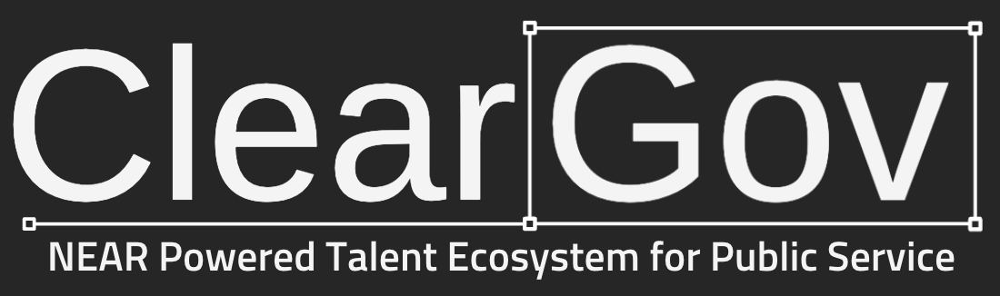
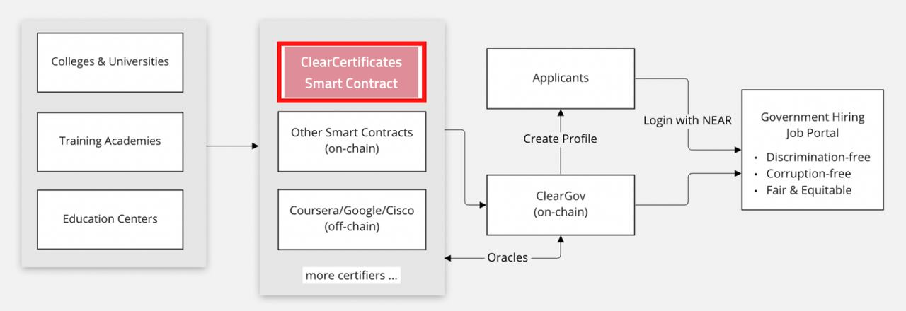

# Nearcon 2022 - ClearGov





[DevPost link](https://devpost.com/software/title-1-dao)

## ClearCertificates

**Run it locally**. Remember to install `node_modules`.

```bash
# start a fresh dev account to have a clean smart-contract
npm run step1
```

```bash
# deploy a smart-contract
npm run step2
```

```bash
# run the FE locally and interact with the page
npm run step3
```

> ⚠️ Note: please, consider following the **"happy path**" as FE and the smart-contract itself is not complitly secured

Check the happy path in [our video presentation](https://youtu.be/qJgP7GQFPhM).

Use 2 browsers to manage 2 flows, as Student and as School.

## ClearJobs

> ⚠️ Note: clear-jobs smart contract and front-end is still in progress

Check our figma prototypes:

- [admin flow](https://www.figma.com/proto/9Kc1YBMOgweqyyVFlqirCG/clear-gov?page-id=0%3A1&node-id=5%3A77585&viewport=-209%2C1348%2C0.13&scaling=min-zoom&starting-point-node-id=5%3A77585&show-proto-sidebar=1)
- [applicant flow](https://www.figma.com/proto/9Kc1YBMOgweqyyVFlqirCG/clear-gov?page-id=0%3A1&node-id=187%3A11773&viewport=-209%2C1348%2C0.13&scaling=scale-down-width&starting-point-node-id=187%3A11773&show-proto-sidebar=1)
- [institution flow](https://www.figma.com/proto/9Kc1YBMOgweqyyVFlqirCG/clear-gov?page-id=0%3A1&node-id=118%3A10736&viewport=-209%2C1348%2C0.13&scaling=scale-down-width&starting-point-node-id=118%3A10736&show-proto-sidebar=1)
